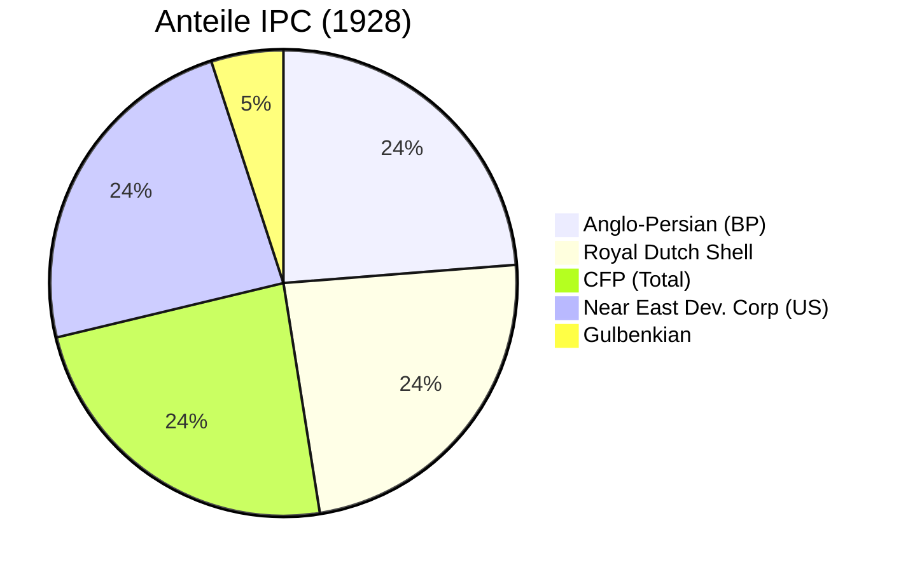

Das **Red Line Agreement** von 1928 war eine geheime Marktaufteilung der großen westlichen Ölkonzerne, die die Struktur der Ölindustrie im Nahen Osten für Jahrzehnte festlegte. Es wird oft als klassisches Beispiel für Kartellbildung und neokoloniale Aufteilung betrachtet.

## Die Rote Linie

Der Legende nach zog Calouste Gulbenkian ("Mr. Five Percent") während der Verhandlungen mit einem roten Buntstift eine Linie auf einer Karte des ehemaligen Osmanischen Reiches. Das Abkommen legte fest, dass innerhalb dieses riesigen Gebiets (das die heutige Türkei, Syrien, Irak, Saudi-Arabien, Jordanien und die VAE umfasste, aber Kuwait und den Iran ausschloss) keiner der Partner **alleine** Öl suchen oder fördern durfte. Jede Aktivität musste durch das gemeinsame Konsortium, die [Iraq Petroleum Company](/organizations/iraq-petroleum-company) (IPC), erfolgen.

## Die Partner

Die Anteilseigner der IPC verpflichteten sich damit zu einer "Selbstbeschränkung" ("Self-Denial Clause"), um Wettbewerb untereinander zu verhindern:
*   **Anglo-Persian** (BP): 23,75%
*   **[Royal Dutch Shell](/organizations/royal-dutch-shell)**: 23,75%
*   **Compagnie Française des Pétroles** (Total): 23,75%
*   **Near East Development Corporation** (Exxon & Mobil): 23,75%
*   **Calouste Gulbenkian**: 5%

## Folgen

Das Abkommen zementierte das Monopol der [Seven Sisters](/organizations/seven-sisters). Es verhinderte effektiv, dass einzelne Konzerne eigene Deals mit lokalen Herrschern machten, was die Preise stabil hoch und die Fördermengen kontrollierbar hielt. Erst nach dem Zweiten Weltkrieg brach das Kartell langsam auf, als amerikanische Firmen (Aramco) das Abkommen umgingen, um in Saudi-Arabien aktiv zu werden.

## Verbindungen

- [Seven Sisters](/organizations/seven-sisters) – Die Profiteure der Marktaufteilung
- [Royal Dutch Shell](/organizations/royal-dutch-shell) – Einer der Hauptunterzeichner
- [Iraq Petroleum Company](/organizations/iraq-petroleum-company) – Das operative Vehikel des Konsortiums
