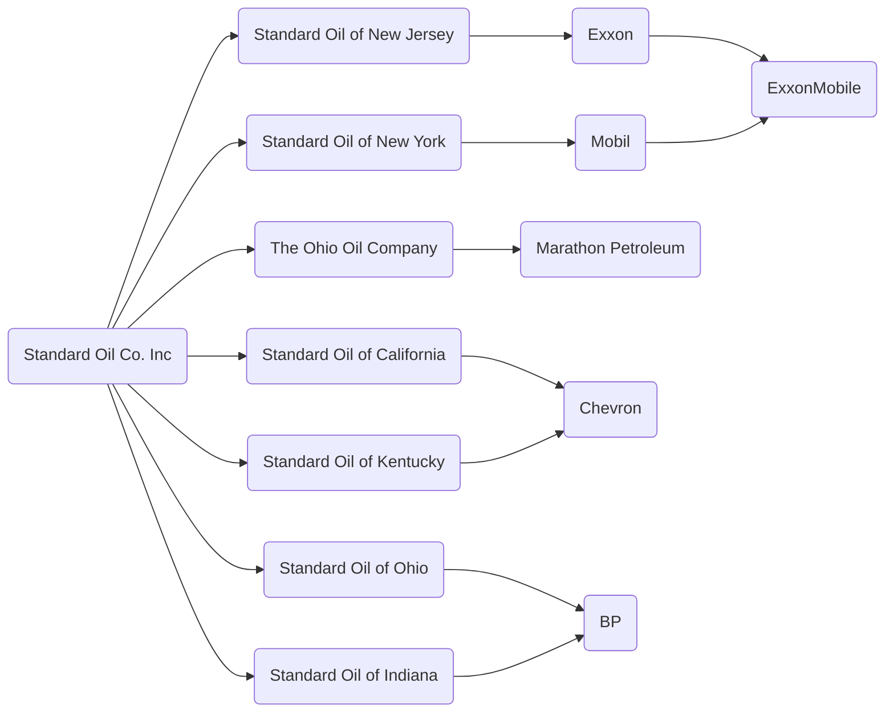

**Standard Oil** war ein US-amerikanisches Ölunternehmen, das von [John D. Rockefeller](/people/john-d-rockefeller) gegründet wurde und zeitweise als mächtigstes Monopol der Welt galt. Es kontrollierte bis zu 90% der US-amerikanischen Ölraffinerien, bevor es 1911 vom Supreme Court zerschlagen wurde.

Diese Notiz dient als Übersicht. Detaillierte Analysen finden sich in den folgenden Zetteln:

Die Standard Oil wurde 1911 in 34 Unternehmen zerschlagen. Die wichtigsten Nachfolgeunternehmen bilden das Herz der amerikanischen Ölindustrie. Das sind

1. The Ohio Oil Company (heute Marathon Petroleum)
2. Standard Oil of Ohio (heute [BP](/organizations/bp))
3. Standard Oil of New Jersey (später Exxon heute ExxonMobil)
4. Standard Oil of New York (später Mobil heute ExxonMobil)
5. Standard Oil of California (heute Chevron)
6. Standard Oil of Indiana (heute [BP](/organizations/bp))
7. Standard Oil of Kentucky (heute Chevron)

## Verbindungen

- [Seven Sisters](/organizations/seven-sisters) – Die Nachfolger, die das globale Kartell bildeten

## Stammdaten

*   **Gründer**: John D. Rockefeller
*   **Gründung**: 1870 in Ohio
*   **Auflösung**: 1911 (Zwangszerschlagung)
*   **Nachfolger**: Exxon, Mobil, Chevron u.a.
