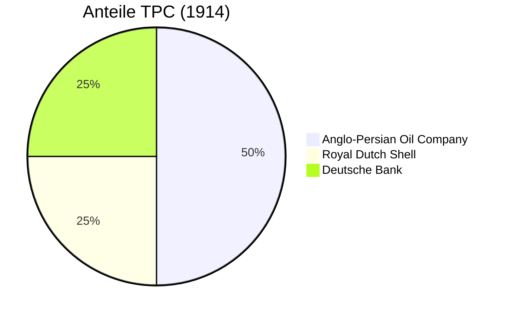

Die **Turkish Petroleum Company** (TPC) war ein internationales Konsortium, das 1912 gegründet wurde, um die Ölressourcen im osmanischen Mesopotamien (heute Irak) zu erschließen. Sie gilt als Vorläufer der **Iraq Petroleum Company** (IPC) und ist ein Beispiel für die Verflechtung von Wirtschaftsinteressen und Diplomatie vor dem Ersten Weltkrieg.

## Gründung und Struktur

Treibende Kraft hinter der Gründung war der armenische Unternehmer Calouste Gulbenkian, der die konkurrierenden Interessen der europäischen Großmächte bündelte. Die ursprüngliche Anteilsverteilung spiegelte das politische Gleichgewicht wider:
*   **[Anglo-Persian Oil Company](/organizations/anglo-persian-oil-company)** (später BP): 50%
*   **[Royal Dutch Shell](/organizations/royal-dutch-shell)**: 25%
*   **Deutsche Bank**: 25%

Gulbenkian selbst hielt keine stimmberechtigten Anteile, sicherte sich aber eine Beteiligung von 5% an den Gewinnen ("Mr. Five Percent").

## Entwicklung

Das Ziel der TPC war die Sicherung einer Konzession für die Provinzen Bagdad und Mossul vom Osmanischen Reich. Diese Zusage wurde zwar 1914 erteilt, jedoch verhinderte der Ausbruch des Ersten Weltkriegs die operative Aufnahme der Förderung.

Nach dem Krieg änderte sich die Eigentümerstruktur als Folge der geopolitischen Neuordnung (siehe [Sykes-Picot-Abkommen (1916)](/events/sykes-picot-abkommen-1916)). Der Anteil der Deutschen Bank wurde als Feindvermögen beschlagnahmt und Frankreich (über die Compagnie Française des Pétroles) übertragen. Dies wurde im [Abkommen von San Remo](/events/konferenz-von-sanremo-1920) (1920) formalisiert. US-amerikanische Unternehmen drängten später ebenfalls in das Konsortium (siehe [Red-Line Agreement (1928)](/events/red-line-agreement-1928)).

1929 wurde das Unternehmen in **[Iraq Petroleum Company](/organizations/iraq-petroleum-company)** umbenannt.
